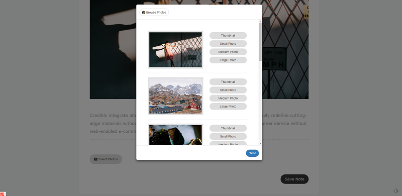
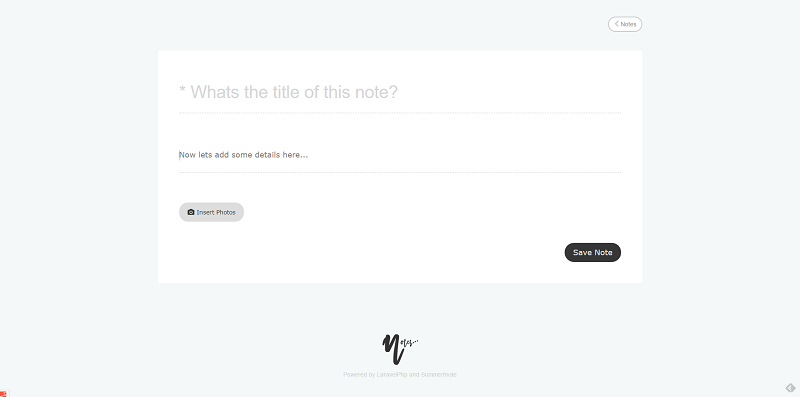
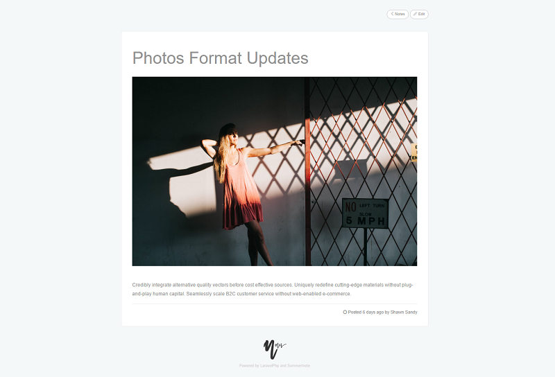

# Summernote

[](https://insight.sensiolabs.com/projects/a1a12aa0-0eb5-4a65-828a-dfce0c47037d)

[](https://www.codacy.com/app/shawnsandy04/snotes?utm_source=github.com&utm_medium=referral&utm_content=shawnsandy/snotes&utm_campaign=badger)
[![Latest Version on Packagist][ico-version]][link-packagist]
[![Software License][ico-license]](LICENSE.md)
[![Total Downloads][ico-downloads]][link-downloads]

A Simple note taking Laravel app built on Summernote, use as a standalone or use it to integrate summernote in your laravel based sites.

## Screenshot







## Install

Via Composer

``` bash
$ composer require shawnsandy/summernote
```

## Usage

Add to following to you `config\app.php`

``` php

ShawnSandy\Summernote\SummerNoteServicesProvider::class
 
```

### Quick Setup

- Publish the package assets 

``` bash 
php artisan vendor:publish --tag=summernote-assets
```

- Open your `App/User.php` and add NotesTrait you can find out more on traits here 

```php

use ShawnSandy\Summernote\App\Notes\NotesTrait;

class User extends Authenticatable
{

    use NotesTrait;

}

```

- Go to http://yoursite.com/snotes


## Change log

Please see [CHANGELOG](CHANGELOG.md) for more information what has changed recently.

## Testing

``` bash
$ composer test
```

## Contributing

Please see [CONTRIBUTING](CONTRIBUTING.md) and [CONDUCT](CONDUCT.md) for details.

## Security

If you discover any security related issues, please email shawnsandy04@gmail.com instead of using the issue tracker.

## Credits

- [Shawn Sandy][link-author]
- [All Contributors][link-contributors]

## License

The MIT License (MIT). Please see [License File](LICENSE.md) for more information.

[ico-version]: https://img.shields.io/packagist/v/shawnsandy/summernote.svg?style=flat-square
[ico-license]: https://img.shields.io/badge/license-MIT-brightgreen.svg?style=flat-square
[ico-downloads]: https://img.shields.io/packagist/dt/shawnsandy/summernote.svg?style=flat-square

[link-packagist]: https://packagist.org/packages/shawnsandy/summernote
[link-downloads]: https://packagist.org/packages/shawnsandy/summernote
[link-author]: https://github.com/shawnsandy

